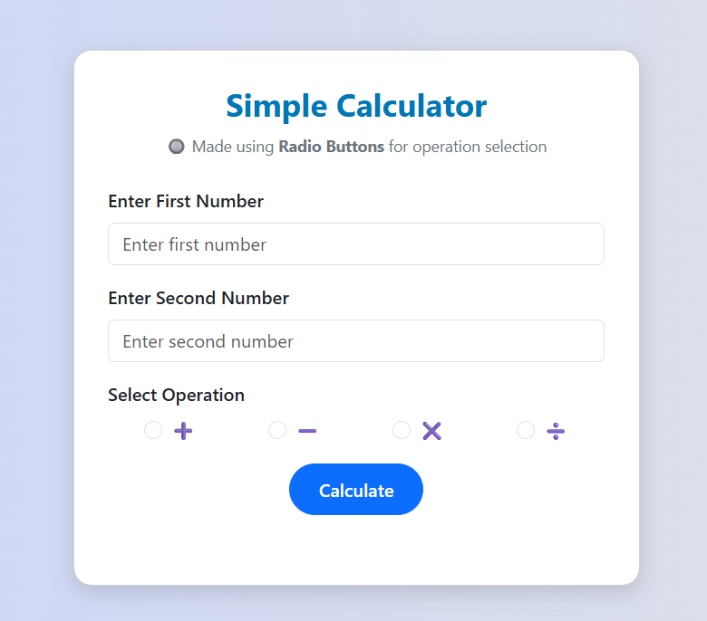

# 🎛️ Radio Button Calculator

A simple and interactive calculator built using **HTML**, **CSS**, **JavaScript** and **Bootstrap**, where users select operations using **radio buttons** instead of dropdowns or buttons.  
This project demonstrates DOM manipulation, input handling, validation, and clean UI concepts.

---

## 📸 Screenshot



> *(Replace `screenshot.png` with your actual image name or external link)*

---

## ✨ Features

- ➕ Addition  
- ➖ Subtraction  
- ✖️ Multiplication  
- ➗ Division (with zero check)  
- 🎨 Clean responsive UI using Bootstrap  
- 📱 Works on mobile & desktop  
- 🧮 Input validation included

---

## 🛠️ Tech Stack

- **HTML5**
- **CSS3**
- **Bootstrap 5**
- **JavaScript (Vanilla)**

---

## 🚀 How to Use

1. Enter the first number
2. Enter the second number
3. Select one of the operations using radio buttons
4. Click **Calculate**
5. View the result below 🎉

---

## 📂 Project Structure

```
/project-folder
  ├── index.html
  ├── README.md
  └── screenshot.png  (optional)
```

---

## 📚 Learning Highlights

This mini project helps understand:

✔ DOM querying & event handling  
✔ Handling numeric inputs  
✔ Basic validation  
✔ Bootstrap-based layout  
✔ Conditional logic via JavaScript `switch`  
✔ Updating UI dynamically

---

## 📝 License

This project is licensed under the **MIT License**, so you're free to use and modify it.

---

## 🤝 Contributing

Pull requests are welcome! For major changes, open an issue first to discuss what you'd like to improve.

---

## 💬 Contact

Feel free to reach out if you have suggestions or questions!
